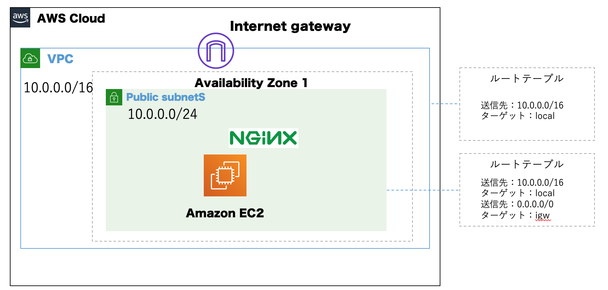

# AWS超入門  
## 勉強会の目的  
社内のクラウドを触ったことのない人たち向けにAWSのリソースを使ってもらいクラウドの手軽さを知ってもらう。  

## 目次  
- 最終成果物のイメージ  
- VPCで仮想ネットワークを構築する  
- EC2(仮想サーバー)を構築し、webサーバーをインストールする  
- リソースのクリーンアップ  

## 最終成果物のイメージ  


## 課題1 VPCで仮想ネットワークを構築する  
1. コンソールからVPCを選択し、【VPCウィザードの起動】を選択  
2. 【1個のパブリックサブネットを持つVPC】を選択  
3. VPC名、アベイラビリティゾーンの欄に任意のVPC名、ゾーンを入力
4. 【VPCの作成】を選択
5. VPCダッシュボードからVPCが作成されていることを確認する

## 課題2　EC2(仮想サーバー)を構築しwebサーバーをインストールする  
1. コンソールからEC2を選択し【インスタンスの作成】を選択  
2. AMIをAmazon Linux、インスタンスタイプをt2.microに設定し、【次の手順】を選択  
3. ネットワーク、サブネットの欄に自分で作成したものを選択、【自動割り当てパブリックIP】の設定を有効にする(これを有効にしないとIPが割り当てられずSSH接続ができない) 
4. ストレージの設定はデフォルト  
5. 【タグの追加】の設定ではキーにName,値に任意の名前をつける 
6. セキュリティグループの設定でセキュリティグループ名を任意に変える。 
7. 【起動】を選択するとキーペアの作成の有無を聞かれるので新規に作成する  
8. 適当なディレクトリを作成し、そこにダウンロードしたpemファイル(秘密鍵)を置く。 以下コマンドでssh接続。 
`ssh -i <your-key>.pem ec2-user@xxx.xxx.xxx.xxx`
9. Nginxのインストール  

```
sudo yum install nginx -y
```

10. Nginxを起動。    

```
sudo service  nginx start
```  

## 課題3(チャレンジ) ブラウザからNginxのウェルカムページを表示させてください。  

## 課題4(オプション) 作成したVPCの中に新たにパブリックサブネットを作成してください。そのサブネットの中にEC2インスタンス(t2.micro)を作成し、既存のキーペアを使いsshでログインしてください。


## リソースのクリーンアップ  
講師の指示に従い削除してください。


